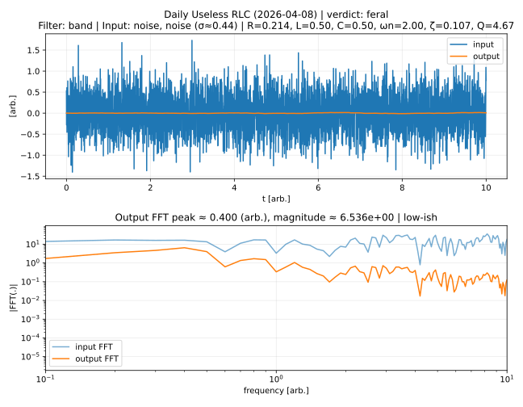

# Daily Useless Physics

Every day, GitHub Actions generates a **random dynamical system**
and excites it with a **random input signal**.

## Today's Result (2026-02-05)

- **System**: RC
- **Filter kind (random by system)**: high
- **Parameters**: R=10.00, C=0.20, τ=2.00
- **Input**: impulse (area≈1.36)

### Useless judgement
- **verdict**: **feral**
- overshoot-ish: 1.000
- wiggles: 2
- FFT peak (output): 0.100 (arb.)
- rough shape guess from |Y|/|X|: band/flat-ish

> We observed a rare event: uncontrolled confidence.

