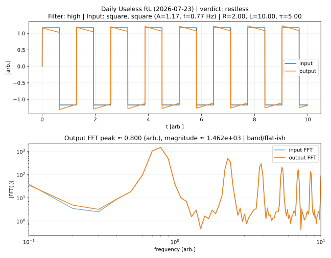

# Daily Useless Physics

Every day, GitHub Actions generates a **random dynamical system**
and excites it with a **random input signal**.

## Today's Result (2026-04-27)

- **System**: RLC
- **Filter kind (random by system)**: band
- **Parameters**: R=0.312, L=2.00, C=0.50, ωn=1.00, ζ=0.078, Q=6.41
- **Input**: noise (σ≈0.61)

### Useless judgement
- **verdict**: **feral**
- overshoot-ish: 1.274
- wiggles: 1365
- FFT peak (output): 0.200 (arb.)
- rough shape guess from |Y|/|X|: low-ish

> A resonance-like thing happened. Please do not ask why.

