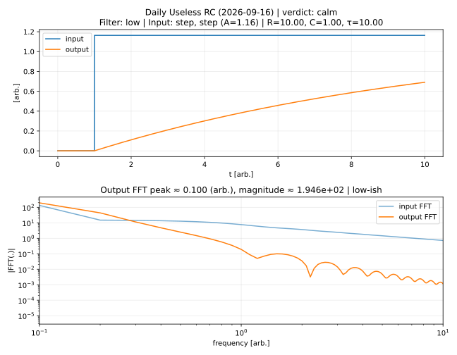

# Daily Useless Physics

Every day, GitHub Actions generates a **random dynamical system**
and excites it with a **random input signal**.

## Today's Result (2026-08-07)

- **System**: RL
- **Filter kind (random by system)**: low
- **Parameters**: R=10.00, L=5.00, τ=0.50
- **Input**: noise (σ≈0.56)

### Useless judgement
- **verdict**: **feral**
- overshoot-ish: 0.806
- wiggles: 2021
- FFT peak (output): 0.100 (arb.)
- rough shape guess from |Y|/|X|: low-ish

> The system chose violence (mathematically).

