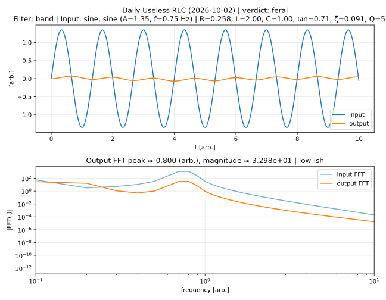

# Daily Useless Physics

Every day, GitHub Actions generates a **random dynamical system**
and excites it with a **random input signal**.

## Today's Result (2026-10-10)

- **System**: RL
- **Filter kind (random by system)**: high
- **Parameters**: R=1.00, L=10.00, τ=10.00
- **Input**: sine (A=1.21, f=0.27 Hz)

### Useless judgement
- **verdict**: **feral**
- overshoot-ish: 1.319
- wiggles: 5
- FFT peak (output): 0.300 (arb.)
- rough shape guess from |Y|/|X|: band/flat-ish

> The system chose violence (mathematically).

